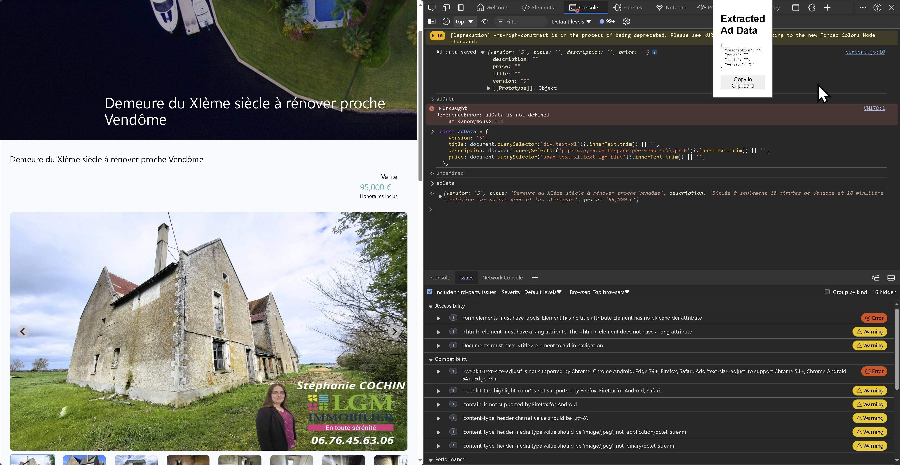

# Goal
Extract from LGM page the content in the clipboard in JSON to be copied a Notion Page based on this JSON content
## Documentation, help
I already downloaded the Demos from this link
https://github.com/MicrosoftDocs/edge-developer/blob/main/microsoft-edge/extensions-chromium/developer-guide/devtools-extension.md

I have built these 2 extensions using ChatGPT but the LGMImmoblierPageToJson does not work, the data is not loaded in the variable.
But when we try to do it manually it works

## LGMImmoblierPageToJson
Extract data from LGM Immobilier page into a json in the clipboard
My example is this page: https://www.lgm-immobilier.fr/biens/2df43473-demeure-du-xieme-siecle-a-renover

## JsonToNotionPage
Fill a Notion page based on a JSON content

